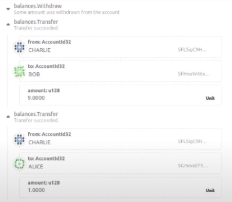

# Gated Marketplace

## Description

A simple description of the project

## TOC

- [Gated Marketplace](#gated-marketplace)
  - [Description](#description)
  - [TOC](#toc)
  - [Setup](#setup)
  - [Order Part of an NFT](#order-part-of-an-nft)
  - [Complete/Confirm Order](#completeconfirm-order)
  - [Order Settlement](#order-settlement)
  - [Approve Redemption Specialists](#approve-redemption-specialists)
  - [Request Redemption](#request-redemption)
  - [Asset Manager](#asset-manager)
  - [Code Contributors](#code-contributors)

## Setup

To initialize the project make sure that you are running a local node of the solo-chain,
then you need to sign as Sudo the extrinsic `initial_setup()`.

## Order Part of an NFT

To order a fraction of a NFT you need to specify the percentage of the NFT that will be sold, keep in mind that the percentage is measured in 1 -> 100, as integers.

To do that you need to call the `enlist_sell_offer` extrinsic.

Keep in mind that you need to create a marketplace and enroll participants as well as create the fruniques.

## Complete/Confirm Order

To complete the order, you need to call the extrinsic `take_sell_offer` with the user that will buy the NFT, the pallet in the background is in charge of distributing the price and dividing the NFT, as well as paying the fees for the marketplace.

## Order Settlement

To check the fees where distributed we can see it on the block transactions, that should indicate that there is a transfer to the owner of the marketplace and the creator of the order receive the price less the fees.

In this example we sold a NFT for 10 currency units, so whe admin of the market receives 1 unit and the rest is of the price is for the seller.

## Approve Redemption Specialists

The redemption specialists are users that are in charge of making all the IRL process related to the exchange of the tax credit, for the moment the admin of the marketplace takes this responsibility.

## Request Redemption

When a customer buys a tax credit, the customer is allowed to make a request to redeem the NFT, this process takes place on the marketplace, as the redemption specialist should take the responsibility of making the transaction in real life. Also redeeming a NFT causes to lose the ability to spawn new items and freezes it just to say that the NFT does not have any value left.

## Asset Manager

The asset manager is responsible for actually making the transaction, at the moment, the marketplace takes the responsibility of making the transaction as it changes the storage maps in order to move the NFT information into a redeemed version of it.

## Code Contributors

Made with ❤️ by:

<!-- ALL-CONTRIBUTORS-LIST:START - Do not remove or modify this section -->
<!-- prettier-ignore-start -->
<!-- markdownlint-disable -->
<table>
  <tbody>
    <tr>
      <td align="center"><a href="https://github.com/3yekn"> <b>Max Gravitt</b></a> </td>
      <td align="center"><a href="https://github.com/sebastianmontero"> <b>sebastianmontero</b></a> </td>
      <td align="center"><a href="https://github.com/amatsonkali"> <b>Abel Yáñez</b></a> </td>
      <td align="center"><a href="https://github.com/tlacloc"> <b>Tlalocman</b></a> </td>
      <td align="center"><a href="https://github.com/didiermis"> <b>Didier Mis</b></a> </td>
    </tr>
  </tbody>
</table>

<!-- markdownlint-restore -->
<!-- prettier-ignore-end -->

<!-- ALL-CONTRIBUTORS-LIST:END -->
