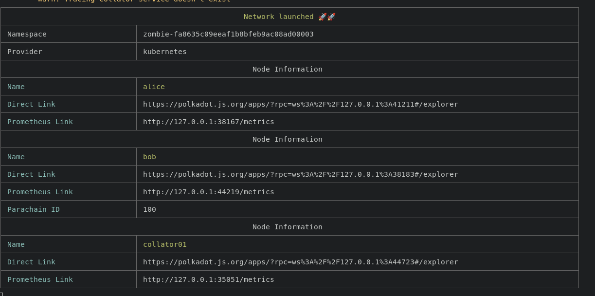
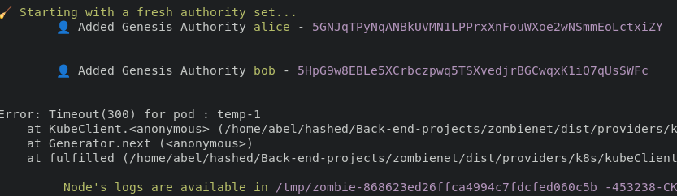
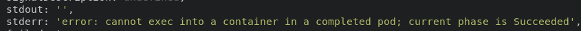
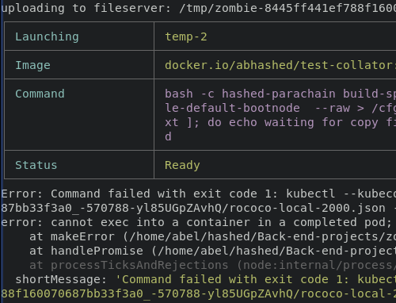
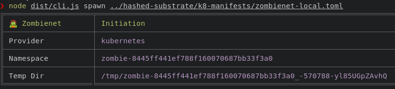

# Zombienet overview

- [Zombienet overview](#zombienet-overview)
  - [Requirements](#requirements)
  - [Initial setup](#initial-setup)
  - [Creating a zombienet-valid dockerfile](#creating-a-zombienet-valid-dockerfile)
  - [Creating the zombienet manifest](#creating-the-zombienet-manifest)
  - [Deploying the custom parachain locally](#deploying-the-custom-parachain-locally)
  - [Updating the parachain image](#updating-the-parachain-image)
  - [Troubleshooting](#troubleshooting)
    - [Timeout errors](#timeout-errors)
    - [Cannot exec into a container in a completed pod](#cannot-exec-into-a-container-in-a-completed-pod)

## Requirements
- Docker
- Dockerhub account
- Minikube
- Kubectl
- Node 16
- Clone and follow the [Zombienet installation and setup](https://github.com/paritytech/zombienet#installation) (PATH setup is optional)

## Initial setup

First, start the minikube cluster.

```bash
minikube start
```

Within the Zombienet repo directory, make sure that the tool is deploying the network examples correctly.
```bash
cd zombienet
node dist/cli.js spawn ./examples/0001-small-network.toml
```
If the process results in a Timeout error, refer to the [troubleshooting guide](#timeout-errors) taking into consideration the image that zombienet failed to pull.

After some intermediate tables, a successful deployment should print a `Network launched 🚀🚀` table. Note that the polkadotjs endpoints are specified in the `Direct link` rows. Both the relay and parachain should be running at this point.


By pressing `ctr+c` all the processes should stop.

The zombienet manifest that was deployed is a simple relaychain to parachain connection, in which the rococo chain has 2 nodes (alice and bob nodes), while the connected parachain (100) is a template with only one collator:
```toml
[relaychain]
default_image = "docker.io/paritypr/polkadot-debug:master"
default_command = "polkadot"
default_args = [ "-lparachain=debug" ]

chain = "rococo-local"

  [[relaychain.nodes]]
  name = "alice"
  validator = true

  [[relaychain.nodes]]
  name = "bob"
  validator = true

[[parachains]]
id = 100

  [parachains.collator]
  name = "collator01"
  image = "docker.io/paritypr/colander:master"
  command = "adder-collator"
```
The `command = "adder-collator"` specifies the node executable (similar to `./target/release/hashed-parachain`). 

## Creating a zombienet-valid dockerfile 
The next section will be performed under the parachain repository instead of the zombienet one.

Now that all the tools are functional, the next step is to create a docker image that replaces the parachain template (the file exists in this repository under the name of `collator.Dockerfile`):
```docker
FROM paritytech/ci-linux:production

# this dir doesnt exists but zombienet script tries to create a file within
RUN mkdir /cfg

WORKDIR /var/www

RUN git clone https://github.com/hashed-io/hashed-substrate.git

WORKDIR /var/www/hashed-substrate
# change to main or develop
RUN git checkout develop && cargo build --release

EXPOSE 30333 40333 9933 9944 9946

# add binary to usr folder, according to the best practices
RUN mv /var/www/hashed-substrate/target/release/hashed-parachain /usr/local/bin

# check if executable works in this container
RUN /usr/local/bin/hashed-parachain --version
# ENTRYPOINT allows to add parameters/flags via k8 manifests
ENTRYPOINT [ "hashed-parachain" ]
```

Build and publish the docker image using the `collator.Dockerfile`, it is recommended to change the tag and name: 
```bash
# change abhashed/test-collator to a desired tag/dockerhub-name. Building the image will take a while.
docker build -t abhashed/test-collator -f collator.Dockerfile .
# When the process is finished, push the image to the desired dockerhub account.
docker push abhashed/test-collator
```

## Creating the zombienet manifest
Based on the example provided by zombienet, a simple deployment was declared using a compatible `polkadot` image (in this case, v0.9.27), while the parachain nodes will be instanced from the custom docker image (this file exists in this repo under the name `k8-manifests/zombienet-local.toml`).
```toml
[relaychain]
default_image = "docker.io/parity/polkadot:v0.9.27"
default_command = "polkadot"
default_args = [ "-lparachain=debug" ]

chain = "rococo-local"

  [[relaychain.nodes]]
  name = "alice"
  validator = true

  [[relaychain.nodes]]
  name = "bob"
  validator = true

[[parachains]]
# it can be any number, doesn't need be aligned to the parachain_id declared on the chainspec
id = 2000 
cumulus_based = true

  [parachains.collator]
  name = "collator01"
  image = "docker.io/abhashed/test-collator"
  command = "hashed-parachain"
```

## Deploying the custom parachain locally

It is highly recommended to pull the published parachain image before deploying [using these steps](#timeout-errors), as it is highly probable to get timeout errors due to the image size.

When executing the zombienet command, the only thing that must be specified is the zombienet manifest (in this case, `../hashed-substrate/k8-manifests/zombienet-local.toml`) instead of the example file.

```bash
node dist/cli.js spawn ../hashed-substrate/k8-manifests/zombienet-local.toml
```

The process should display an almost identical process from the testing deployment.

## Updating the parachain image
If there's a change that needs to be locally tested, it is recommended to rebuild and publish the docker image and [download the update on minikube](#timeout-errors).

## Troubleshooting

### Timeout errors

If an image takes too long to download, it will result in a timeout error. It is recommended to pull the required images beforehand.
```bash
# Enter to the minikube container through ssh
minikube ssh
# Pull the required images, it may take a while
docker@minikube:~$ docker pull abhashed/test-collator
# When finished exit the minikube container
docker@minikube:~$ exit
# Retry the zombienet deployment process
node dist/cli.js spawn ./examples/md5.toml
```
It is also recommended to check if the image is published by the same name and tag. 

### Cannot exec into a container in a completed pod



This error usually implies there's at least one misconfiguration on the parachain image, the following examples were found:
- Zombienet tried to create a file in a directory that doesn't exist.
- The parachain executable (e.g. `./target/release/hashed-parachain`) wasn't found in the provided `command = <executable>` path.
- Zombienet tried to replace the `para_id` in the chain spec, but it wasn't found.
- Any other issue that might cause the container to end unexpectedly.

In order to discover the exact issue, the following steps are recommended:
1. Zombienet produces intermediate pods for each step. Identify the last pod that was instanced successfully before the error logs appeared (e.g. `temp-1`, `temp-2`, etc).

2. Prepare another terminal with the command for getting the logs for the temporal pod (e.g `kubectl logs -f temp-2 -n <namespace>`), the namespace will be pasted when available on later steps.
3. In the first terminal, run the zombienet spawn command again, the first table will have the generated namespace, copy the string. 

4. Paste the string in the namespace option on the second terminal to complete the command (e.g `kubectl logs -f temp-2 -n zombie-8445ff441ef788f160070687bb33f3a0`), and run the command when the first terminal initializes the desired container, in this case, temp-2.
5. The output should contain an error description. 
```
❯ kubectl logs -f temp-2 -n zombie-943cbea55d3294c8968afeca7dcf8bd3
Defaulted container "temp-2" out of: temp-2, transfer-files-container (init)
Error: Input("Error parsing spec file: unknown field `para_id` at line 113 column 1")
copy files has finished
```
In this specific case, the para_id field was not recognized by the chain, which means the `#[serde(rename_all = "camelCase")]` line in the `collator/src/chain_spec/mod.rs` was renaming para_id as paraId, causing conflicts in the zombienet internal processes. Removing that line was enough to fix the error.